# 🚗 RentRover

RentRover is a modern, full-featured car rental application built with Flutter and Supabase. The app provides a seamless experience for users to discover, browse, and book cars in real time, manage their bookings, and securely authenticate their accounts. Designed with clean UI and robust state management, RentRover can serve as a solid foundation for any rental service platform.

---

## ✨ Features

- 🔐 **Authentication**  
  Sign up, log in, and manage user sessions via Supabase Auth.

- 🚘 **Car Listings**  
  Browse and view detailed car information including images, price per day, fuel capacity, and more.

- 📆 **Bookings**  
  Create and manage bookings with start/end dates, live availability checks, and status tracking.

- 📡 **Real-time Data**  
  All data—cars, bookings, and users—is synced with Supabase in real time.

- 🎨 **Clean UI**  
  Flutter-powered responsive interface with GetX for state management.

---

## 🗄️ Database Schema (Supabase)

### Users
| Field         | Type       |
|---------------|------------|
| id            | uuid (PK)  |
| username      | text       |
| email         | text       |
| profile_image | text       |
| created_at    | timestamptz|

### Cars
| Field           | Type       |
|-----------------|------------|
| id              | uuid (PK)  |
| name            | text       |
| description     | text       |
| images          | _text      |
| price_per_day   | float4     |
| location        | text       |
| is_available    | boolean    |
| created_at      | timestamp  |
| fuelCapacity    | float4     |
| transmission    | text       |
| seats           | int4       |
| latitude        | float8     |
| longitude       | float8     |

### Bookings
| Field       | Type      |
|-------------|-----------|
| id          | uuid (PK) |
| car_id      | uuid (FK) |
| user_id     | uuid (FK) |
| start_time  | timestamp |
| end_time    | timestamp |
| status      | text      |
| created_at  | timestamp |

---

## 🛠️ Tech Stack

- **Flutter** – Cross-platform mobile development
- **Supabase** – Backend (Auth + Database)
- **GetX** – State management and navigation
- **DiceBear Avatars** – Default profile images

---

## 🚀 Getting Started

### Clone the repo
```

git clone [https://github.com/yourusername/rentrover.git](https://github.com/yourusername/rentrover.git)
cd rentrover

```

### Install dependencies
```

flutter pub get

````

### Configure Supabase
Create a `.env` or use `Supabase.initialize()` in `main.dart`:

```dart
await Supabase.initialize(
  url: 'https://your-supabase-url.supabase.co',
  anonKey: 'your-anon-key',
);
````

### Run the app

```
flutter run
```

---

## 🧩 Folder Structure

```
lib/
 ├── bindings.dart                 # Initial bindings for GetX
 ├── controllers/
 │     ├── auth_controller.dart
 │     ├── user_controller.dart
 │     ├── current_bookings_controller.dart
 │
 ├── data/
 │     ├── local/                  # Local storage (Hive, SharedPreferences)
 │     ├── models/                 # Data models
 │     └── services/               # Supabase or API services
 │
 ├── presentation/
 │     ├── screens/
 │     │     ├── auth/
 │     │     ├── car_details/
 │     │     ├── bookings/
 │     │     └── main_scaffold.dart
 │     └── widgets/
 │
 ├── utils/
 │     └── constants.dart          # App-wide constants
 │
 └── main.dart
```

---

## 🤝 Contributing

Pull requests and stars are welcome!

1. Fork the project
2. Create your feature branch (`git checkout -b feature/awesome-feature`)
3. Commit your changes (`git commit -m 'Add awesome feature'`)
4. Push to the branch (`git push origin feature/awesome-feature`)
5. Open a Pull Request

---

## 📸 Screenshots

<div align="center"> 
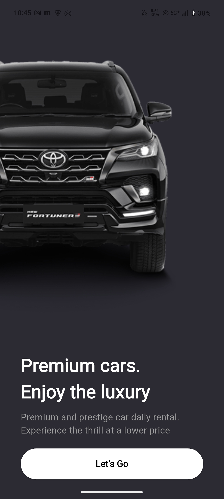 
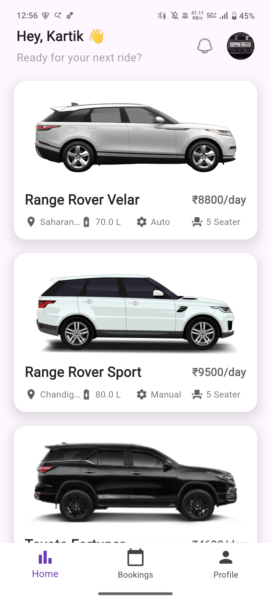 
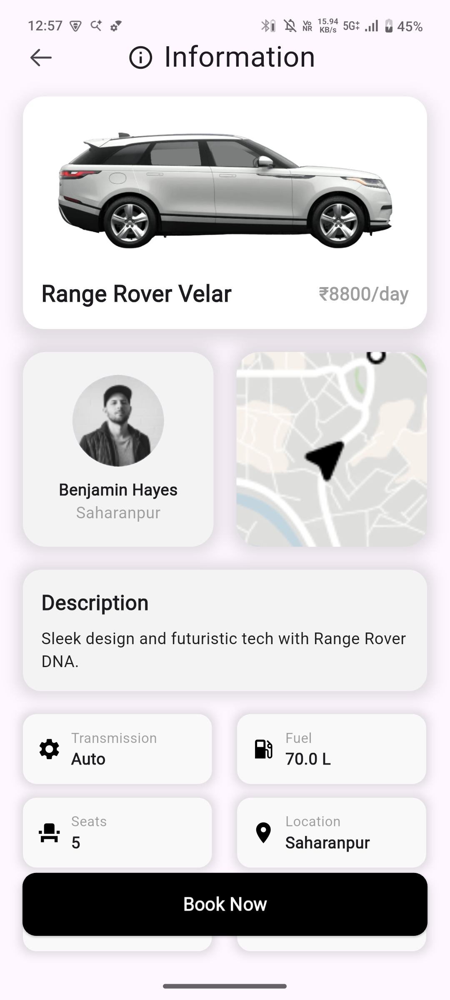 
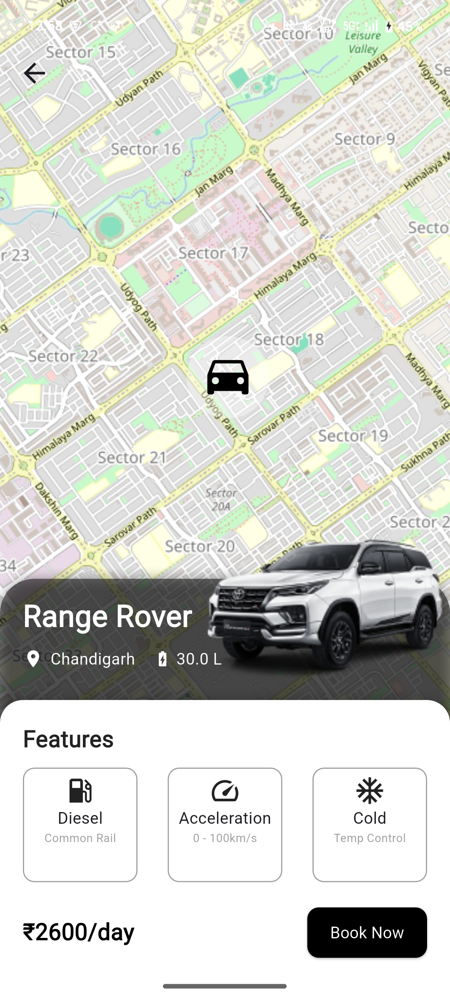 

<br><br>

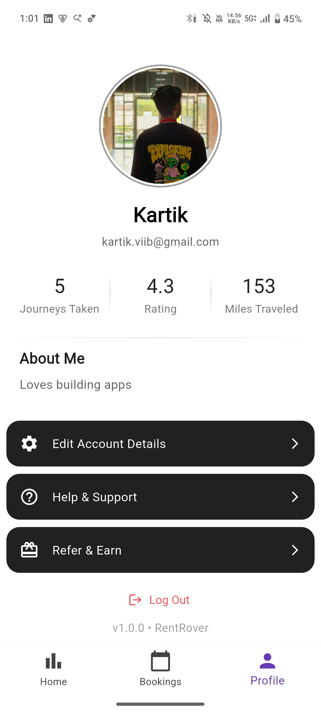 
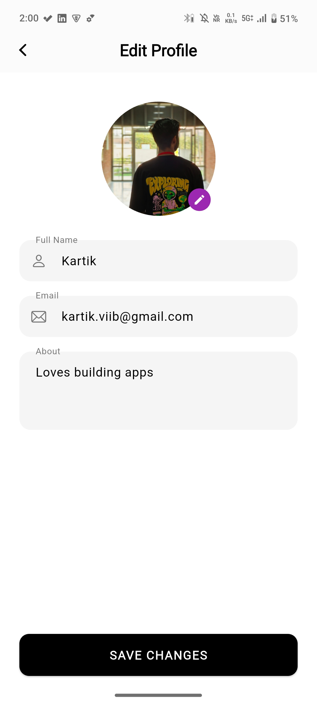
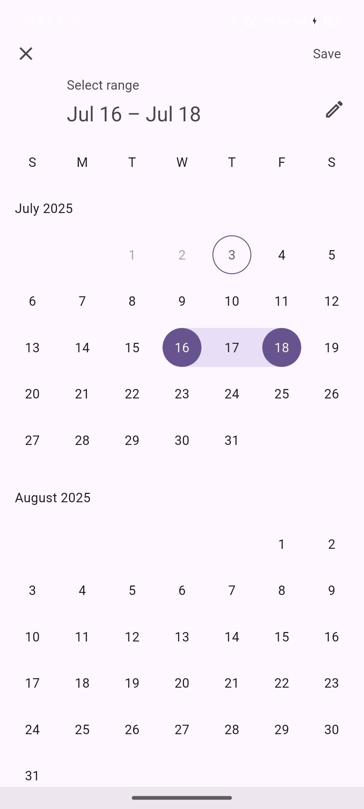 
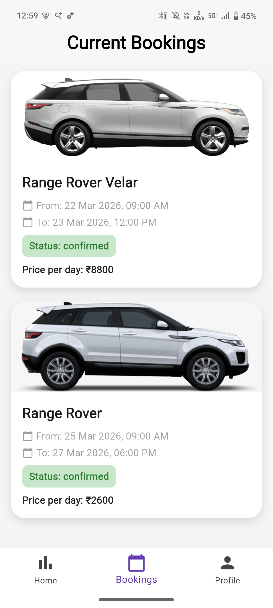 

<br><br>

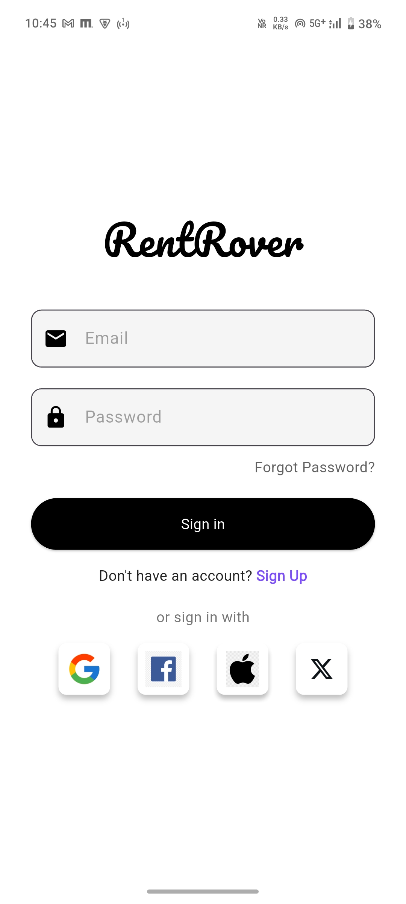 
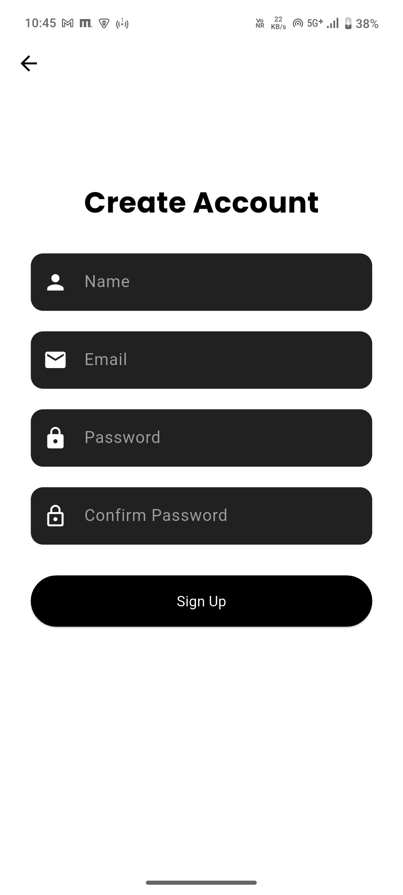
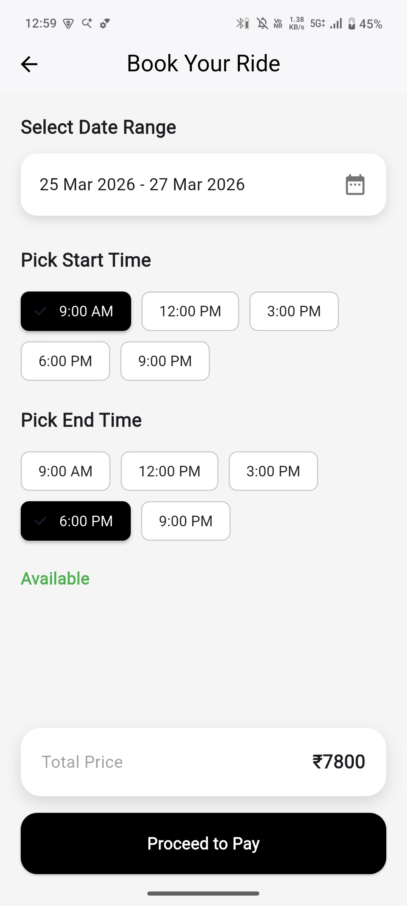 
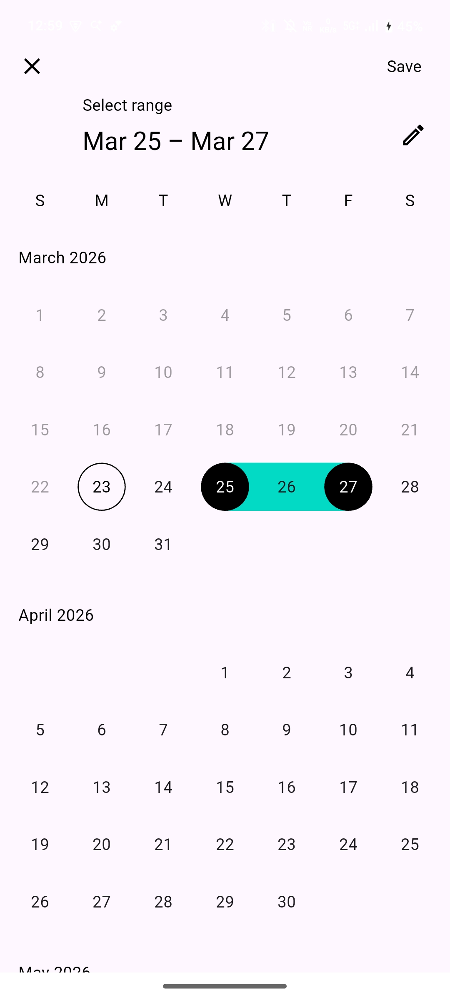 
</div>

---

## 📄 License

This project is licensed under the MIT License.


