# 🚗 RentRover

RentRover is a modern, full-featured car rental application built with Flutter and Supabase. The app provides a seamless experience for users to discover, browse, and book cars in real time, manage their bookings, and securely authenticate their accounts. Designed with clean UI and robust state management, RentRover can serve as a solid foundation for any rental service platform.

---

## ✨ Features

- 🔐 **Authentication**  
  Secure user authentication with Supabase Auth, including signup, login, and persistent session management.

- 🚘 **Car Listings**  
  Explore detailed car listings with images, pricing, specifications, and availability for an informed booking experience.

- 📆 **Bookings**  
  Seamlessly create and manage bookings with date selection, real-time availability validation, and status tracking.

- 📡 **Real-time Data**  
  Powered by Supabase for live synchronization of cars, bookings, and user data across the app.

- 🎨 **Clean UI**  
  Modern, responsive Flutter interface with GetX for efficient state management and smooth navigation.
---

## 🗄️ Database Schema (Supabase)

<div style="display: flex; gap: 40px;">

<div>

### Users
| Field           | Type        |
|----------------|------------|
| id             | uuid (PK)  |
| username       | text       |
| email          | text       |
| profile_image  | text       |
| created_at     | timestamptz|
| journeys_taken | int4       |
| rating         | numeric    |
| miles_traveled | numeric    |
| about          | text       |

</div>

<div>

### Cars
| Field           | Type       |
|-----------------|------------|
| id              | uuid (PK)  |
| name            | text       |
| description     | text       |
| images          | text[]     |
| price_per_day   | float4     |
| location        | text       |
| is_available    | boolean    |
| created_at      | timestamp  |
| fuelCapacity    | float4     |
| transmission    | text       |
| seats           | int4       |
| latitude        | float8     |
| longitude       | float8     |
| owner_name      | text       |
| owner_image     | text       |
| model           | text       |

</div>

</div>
<div>

### Bookings
| Field       | Type      |
|-------------|-----------|
| id          | uuid (PK) |
| car_id      | uuid (FK) |
| user_id     | uuid (FK) |
| start_time  | timestamp |
| end_time    | timestamp |
| status      | text      |
| created_at  | timestamp |


</div>
## 🛠️ Tech Stack

- **Flutter** – Cross-platform mobile development
- **Supabase** – Backend (Auth + Database)
- **GetX** – State management and navigation
- **DiceBear Avatars** – Default profile images

---

## 🚀 Getting Started

### Clone the repo
```

git clone [https://github.com/kartikkumarofficial/RentRover](https://github.com/kartikkumarofficial/RentRover)
cd rentrover

```

### Install dependencies
```

flutter pub get

````

### Configure Supabase
Create a `.env` or use `Supabase.initialize()` in `main.dart`:

```dart
await Supabase.initialize(
  url: 'https://your-supabase-url.supabase.co',
  anonKey: 'your-anon-key',
);
````

### Run the app

```
flutter run
```

---

## 🧩 Folder Structure

```
lib/
 ├── bindings.dart                 # Initial bindings for GetX
 ├── controllers/
 │     ├── auth_controller.dart
 │     ├── user_controller.dart
 │     ├── current_bookings_controller.dart
 │
 ├── data/
 │     ├── local/                  # Local storage (Hive, SharedPreferences)
 │     ├── models/                 # Data models
 │     └── services/               # Supabase or API services
 │
 ├── presentation/
 │     ├── screens/
 │     │     ├── auth/
 │     │     ├── car_details/
 │     │     ├── bookings/
 │     │     └── main_scaffold.dart
 │     └── widgets/
 │
 ├── utils/
 │     └── constants.dart          # App-wide constants
 │
 └── main.dart
```

---

## 🤝 Contributing

Pull requests and stars are welcome!

1. Fork the project
2. Create your feature branch (`git checkout -b feature/awesome-feature`)
3. Commit your changes (`git commit -m 'Add awesome feature'`)
4. Push to the branch (`git push origin feature/awesome-feature`)
5. Open a Pull Request

---

## 📸 Screenshots

<div align="center"> 
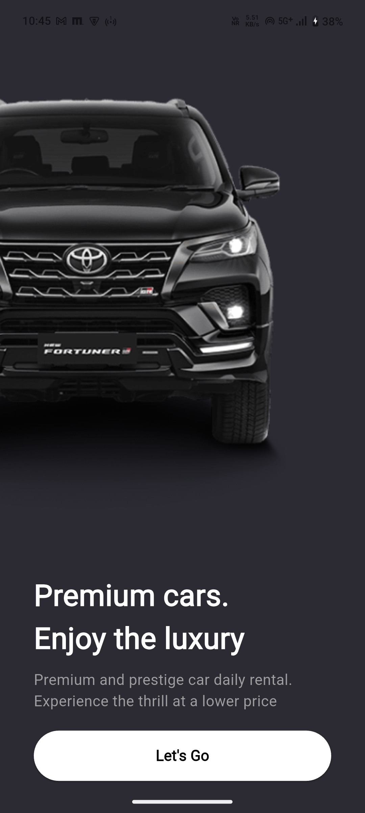 
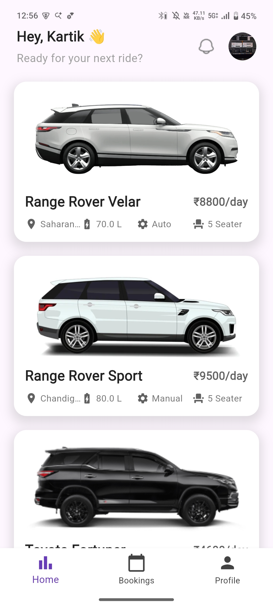 
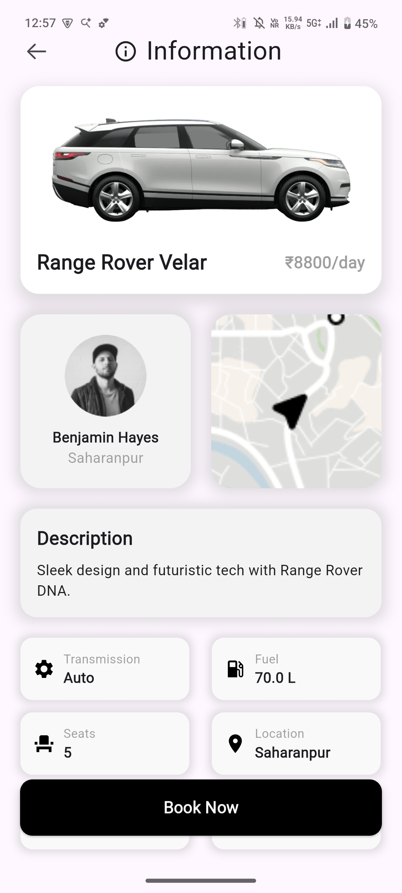 
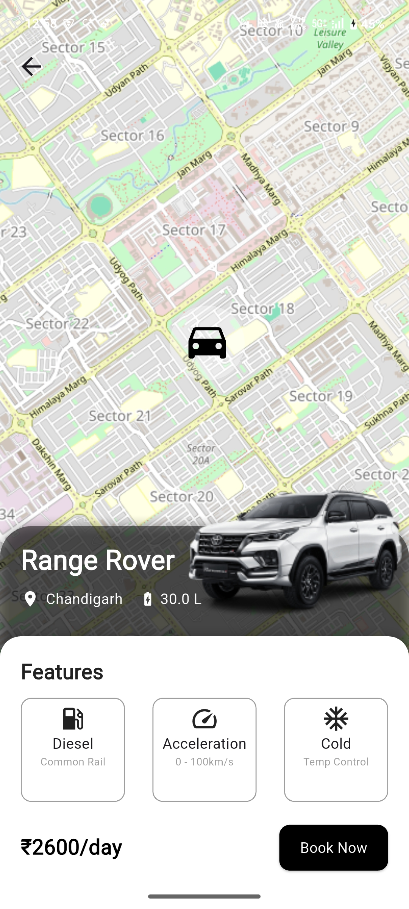 

<br><br>

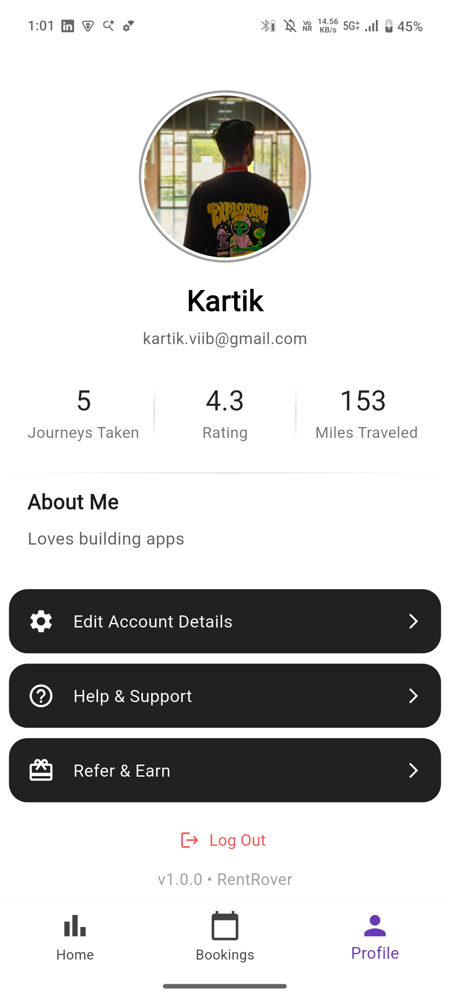 
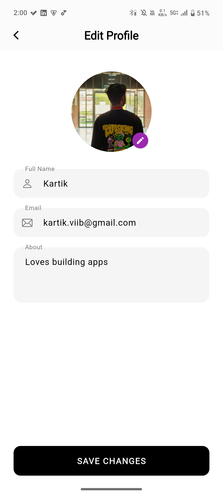
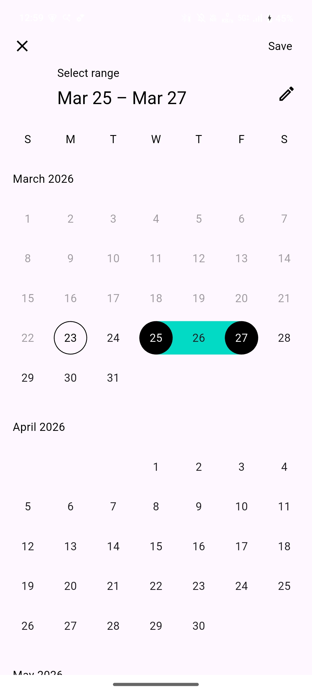 
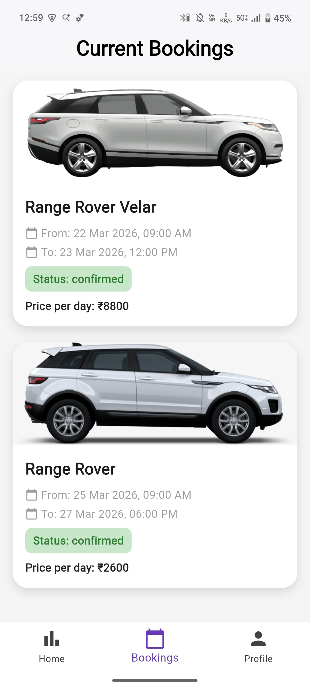 

<br><br>

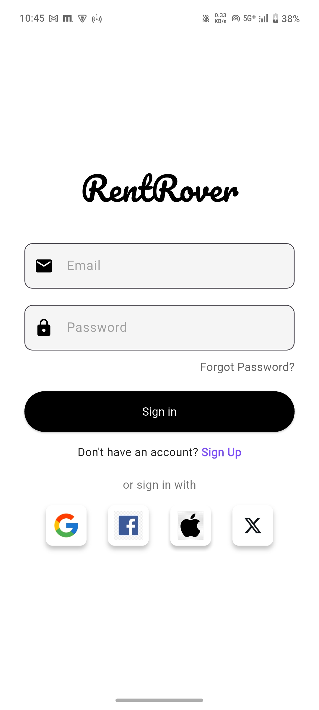 
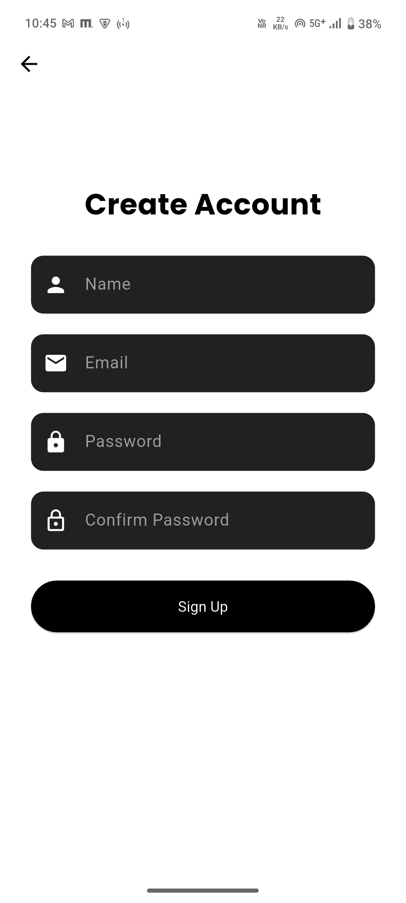
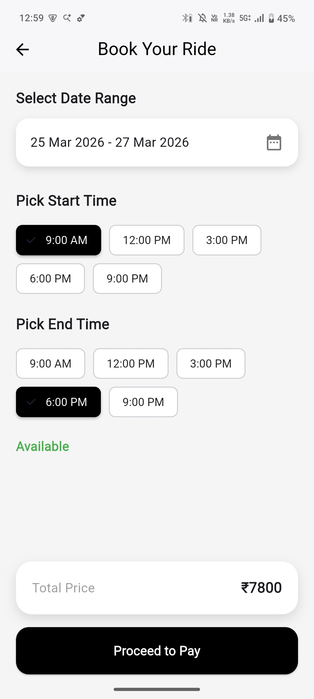 
 
</div>

---

## 📄 License

This project is licensed under the MIT License - see the LICENSE file for details.


